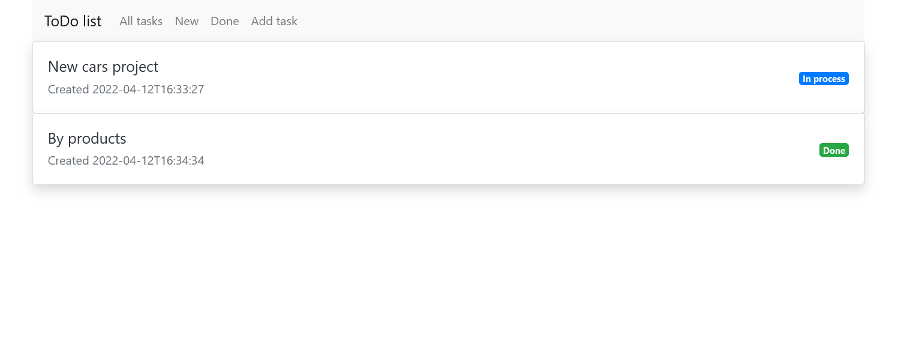
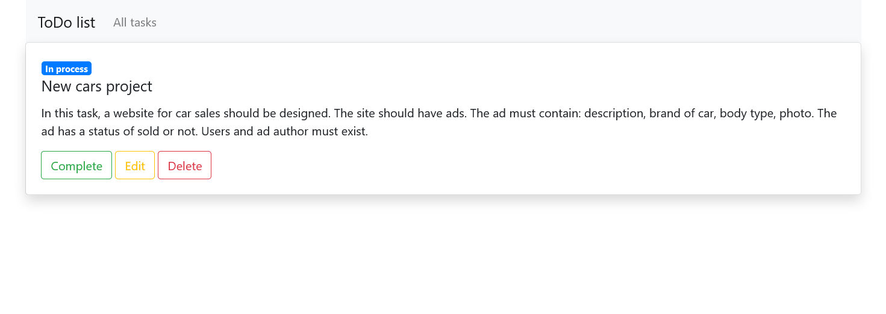
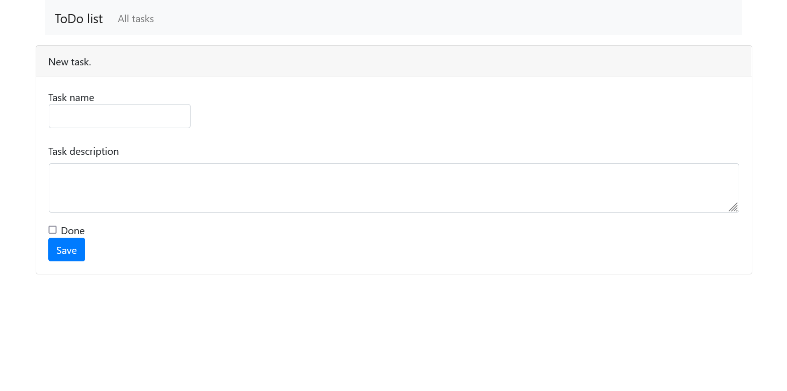

# job4j_todo

## TODO list

The application has one main page with a to-do list of all tasks.
If the task is done, then it is marked as completed. Then it disappears from the list on page newTasks.html.

Technologies used: Spring Boot, Thymeleaf, HTML, CSS, Bootstrap, Hibernate

Description:
1. There is one table in the item database with the fields: id, name, description, created, done. Location /db/
2. The web application has three pages: All tasks, New, Done, Add task.
3. The task list pages display the tasks name, creation time, and completion status.
4. Clicking on the name of the task opens a page with a full description of the task.
5. The description page allows you to complete task, update it or delete. 
6. Data is saved via hibernate.
7. Bootstrap is used for the view.

